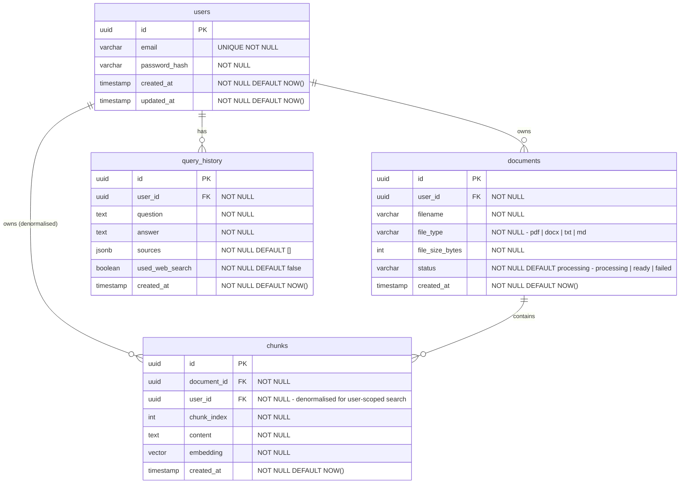
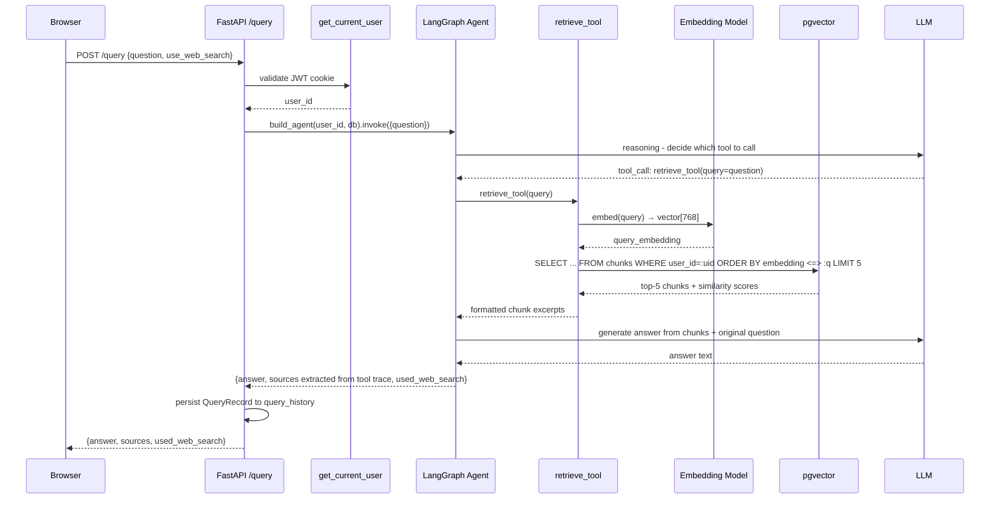

# Technical Design

> ADRs e stored in `docs/adr/`. Each decision referenced below has a corresponding ADR capturing the reasoning at the time it was made.

---

## Architecture Diagram

```mermaid
architecture-beta
    group aws(aws:aws-cloud)[AWS Cloud Production]

    service alb(aws:arch-elastic-load-balancing)[Application Load Balancer] in aws
    service eks(aws:arch-amazon-elastic-kubernetes-service)[EKS FastAPI LangGraph App] in aws
    service rds(aws:res-amazon-aurora-postgresql-instance)[RDS PostgreSQL pgvector] in aws
    service ecr(aws:arch-amazon-elastic-container-registry)[ECR Container Registry] in aws

    group local(server)[Local Development Docker Compose]

    service fastapi_dev(server)[FastAPI LangGraph Agent] in local
    service pg_dev(database)[PostgreSQL pgvector] in local
    service ollama(server)[Ollama LLM and Embeddings] in local

    group ext(cloud)[External APIs]

    service openai(server)[OpenAI GPT 4o Embeddings] in ext
    service tavily(internet)[Tavily Web Search] in ext

    service browser(internet)[Browser Frontend]
    service cicd(server)[GitHub Actions CICD]

    junction junctionEKSExAPI

    browser:R --> T:alb
    alb:R --> L:eks
    eks:R --> L:rds
    eks:B -- T:junctionEKSExAPI
    cicd:B --> T:ecr
    ecr:B --> T:eks

    junctionEKSExAPI:L -- T:openai
    junctionEKSExAPI:L -- R:tavily

    

    browser:B --> T:fastapi_dev
    fastapi_dev:R --> L:pg_dev
    fastapi_dev:T --> B:ollama
```



---

## Data Model

### Entity Relationship Diagram



### Design notes

**Removing data** 
Deleting data from `users` removes all their documents, chunks, and query history. Deleting a document removes its chunks only.

**Indexes**:
- `chunks.embedding` - vector similarity index(ivfflat). Used when a user asks a question — finds the most similar chunks without comparing against every row. Approximate search trades a tiny accuracy loss for a large speed gain.
- `chunks.user_id` - every search filters by the current user first. This makes that filter fast.
- `chunks.document_id` - when a document is deleted, its chunks are deleted too. This makes finding those chunks fast.
- `documents.user_id` - used when loading the dashboard document list for a specific user.
- `query_history.user_id` - prepared for the future query history page.

**`user_id` in the `chunks` table is done intentionally.** The similarity search query will filter by `user_id` directly in the `chunks` table without joining `documents`. This keeps the query path to a single table scan with an index, rather than a join. See ADR-005 for the user isolation strategy.

**`embedding` dimension is fixed at 768.** See ADR-001.

---

## API Design

All state-changing endpoints require a valid HTTP-only JWT access cookie. The `GET /health` and `GET /ready` endpoints are unauthenticated (used by Kubernetes probes).

| Method | Path | Auth | Request body | Response |
|--------|------|------|-------------|----------|
| `GET` | `/health` | None | - | `{"status": "ok"}` |
| `GET` | `/ready` | None | - | `{"status": "ok", "db": "up", "ollama/openai": "up"}` |
| `POST` | `/auth/register` | None | `{email, password}` | `{id, email}` |
| `POST` | `/auth/login` | None | `{email, password}` | Sets `access_token` + `refresh_token` cookies; `{id}` |
| `POST` | `/auth/logout` | Cookie | - | Clears cookies; `204` |
| `POST` | `/auth/refresh` | Refresh cookie | - | Sets new `access_token` cookie; `204` |
| `POST` | `/documents/upload` | Cookie | `multipart/form-data: file` | `{id, filename, file_type, status}` |
| `GET` | `/documents` | Cookie | - | `[{id, filename, file_type, file_size_bytes, status, created_at}]` |
| `DELETE` | `/documents/{id}` | Cookie | - | `204` - cascades to chunks |
| `POST` | `/query` | Cookie | `{question, use_web_search?}` | `{answer, sources, used_web_search}` |

### Key schema details

**Upload - `POST /documents/upload`**
- Validates file extension and magic bytes against allowed types (pdf, docx, txt, md)
- Rejects files over 50MB
- Returns immediately with `status: processing`; ingestion runs synchronously in v1

**Query - `POST /query`**

Request:
```json
{
  "question": "What is the relationship between AWS ECR and EKS.",
  "use_web_search": false
}
```

Response:
```json
{
  "answer": "Amazon ECR acts as the secure, private container image repository for Amazon EKS...",
  "sources": [
    {"document": "aws-container-notes.pdf", "chunk_index": 12, "excerpt": "ECR acts as the secure, private..."}
  ],
  "used_web_search": false
}
```

Sources are extracted from the agent's **tool call trace**, not from the LLM's text output. This prevents citation hallucination - if retrieve_tool was not called, sources is an empty array.

**Error responses** follow a consistent shape: `{"detail": "human-readable message"}` with appropriate HTTP status codes (400 for validation, 401 for unauthenticated, 403 for wrong user, 404 for not found, etc).

---

## Sequence Diagram - Critical Path: User Asks a Question

This is the most complex flow in the system and the one with the most failure points.



**Failure points to handle:**
- `get_current_user` fails → `401 Unauthorized`, never reaches agent
- User has no uploaded documents → retrieve_tool returns empty → LLM responds "I don't have enough information in your documents"
- LLM provider unreachable → `503` with message, nothing persisted
- Agent loop does not terminate → add a `max_iterations` guard to prevent infinite loops (see ADR-004)

---

## Threat Model

**1. How does authentication work?**
JWT stored in an HTTP-only, SameSite=Lax cookie. Access token TTL will be 15 minutes; refresh token TTL will be 7 days. The cookie is inaccessible to JavaScript, preventing XSS-based token theft. `SECURE_COOKIES=True` in production requires HTTPS. Refresh tokens are rotated on each use.

**2. Where are secrets?**
`JWT_SECRET`, `OPENAI_API_KEY`, `TAVILY_API_KEY`, and `DATABASE_URL` live in `.env` (gitignored). `.env.example` with placeholder values will be committed. No secrets in code, logs, or Docker images. CI secrets are stored in GitHub Actions encrypted secrets and injected as environment variables at build time.

**3. What is the user boundary?**
`user_id` is extracted from the JWT by the `get_current_user` FastAPI dependency, it is never read from the request body. `build_agent(user_id, db)` constructs `retrieve_tool` as a closure over that `user_id`. The LLM cannot override `user_id` by manipulating tool arguments because the parameter is not exposed in the tool's input schema. Every similarity search includes `WHERE user_id = :user_id`. See ADR-005.

**4. What happens if the LLM returns garbage?**
The response is validated against a Pydantic schema before being returned to the client. Sources are extracted from the tool call trace in the agent's execution graph, not parsed from the LLM's text output - so even if the LLM hallucinates a citation in its answer text, the `sources` array in the response only contains chunks that `retrieve_tool` actually returned.

**5. What happens if a user uploads a malicious file?**
File type is validated by both extension and magic bytes before processing. `pypdf` and `python-docx` parse in-process. Filename is sanitised (path traversal stripped) before storage. Files are never executed or served directly back to the browser. File size is capped at 50MB to prevent memory exhaustion during parsing.
