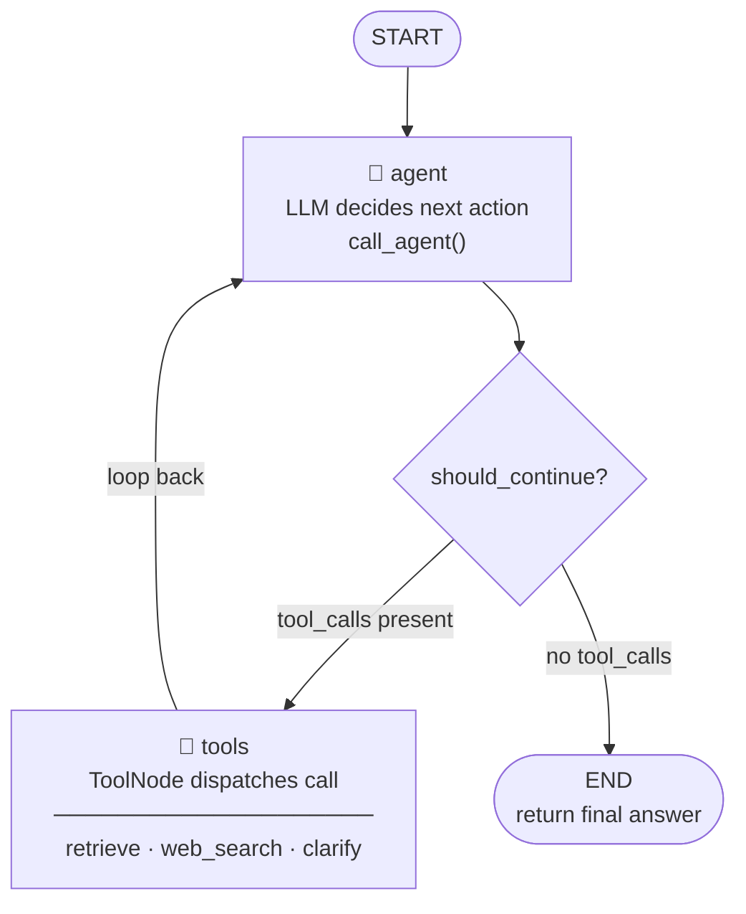

# ADR-004: LangGraph over raw LangChain chains

**Date:** 2026-05-01
**Status:** Validated

## Context

The query flow requires an agent that can:
1. Receive a question
2. Decide which tool to call (retrieve, web search, or clarify)
3. Inspect the tool result and decide whether to call another tool or generate a final answer
4. Loop if the retrieved context is insufficient

Options considered:

| Option | Loop support | State | Tool calling |
|--------|-------------|-------|-------------|
| **LangGraph** `create_react_agent` | Yes — cyclical graph | Persistent across steps | Native |
| **LangChain** | No — linear pipeline | Stateless between steps | Via `AgentExecutor` (deprecated direction) |
| **LlamaIndex** | Yes | Yes | Yes |
| **Hand-rolled ReAct loop** | Yes | Manual | Manual |

LangChain LCEL chains are linear: input flows through steps and exits. They cannot natively branch or loop based on intermediate results. `AgentExecutor` added looping on top of chains but is now superseded by LangGraph in LangChain's own roadmap.

LlamaIndex is a valid alternative but introduces a second framework alongside LangChain, which is already required for the LLM/embedding abstractions (`ChatOllama`, `ChatOpenAI`, `OllamaEmbeddings`) and mixing frameworks adds complexity.

A hand-rolled ReAct loop gives full control but requires re-implementing tool dispatch, memory management, and termination logic — all of which LangGraph provides.

## Decision

Use LangGraph's prebuilt agent factory (`create_agent` in LangGraph 1.x, formerly `create_react_agent` in earlier versions).

```python
from langchain.agents import create_agent  # new home in LangGraph 1.x

agent = create_agent(
    model=get_chat_model(),
    tools=[make_retrieve_tool(user_id, db), web_search_tool, clarify_tool],
    system_prompt=SYSTEM_PROMPT,
)
agent.with_config({"recursion_limit": max_iterations})
```

Set `recursion_limit` to prevent infinite loops (default guard is 10 steps).

### What the factory builds

`create_agent` is a thin wrapper around a manual `StateGraph`. The graph it constructs is equivalent to writing this by hand:

```python
from typing import Annotated, Sequence, TypedDict

from langchain_core.messages import BaseMessage
from langchain_core.prompts import ChatPromptTemplate, MessagesPlaceholder
from langgraph.graph import END, StateGraph
from langgraph.graph.message import add_messages
from langgraph.prebuilt import ToolNode

class AgentState(TypedDict):
    messages: Annotated[Sequence[BaseMessage], add_messages]

SYSTEM_PROMPT = """You are a knowledgeable assistant.
Always use the retrieve tool to search the user's documents before answering.
Ground your answers in the retrieved content and cite your sources.
If the question is unclear, use the clarify tool to ask for more detail.
Only use web_search_tool if the answer cannot be found in the user's documents."""

prompt = ChatPromptTemplate.from_messages([
    ("system", SYSTEM_PROMPT),
    MessagesPlaceholder(variable_name="messages"),
])

tools = [make_retrieve_tool(user_id, db), web_search_tool, clarify_tool]
llm_with_tools = get_chat_model().bind_tools(tools)

async def call_agent(state: AgentState) -> dict:
    """
    The agent node. Calls the LLM with the current conversation history.

    The LLM can respond in two ways:
      1. A tool call  → execution routes to the tools node next
      2. A text answer → execution terminates and the answer is returned
    """
    formatted = prompt.format_messages(messages=state["messages"])
    response = await llm_with_tools.ainvoke(formatted)
    return {"messages": [response]}

tool_node = ToolNode(tools)

def should_continue(state: AgentState) -> str:
    """
    Router function — determines what happens after the agent node runs.

    Returns:
        "tools"  if the LLM chose a tool (tool_calls is non-empty)
        END      if the LLM produced a final text answer
    """
    last_message = state["messages"][-1]

    if hasattr(last_message, "tool_calls") and last_message.tool_calls:
        return "tools"

    return END

workflow = StateGraph(AgentState)

workflow.add_node("agent", call_agent)
workflow.add_node("tools", tool_node)

workflow.set_entry_point("agent")

workflow.add_conditional_edges(
    "agent",
    should_continue,
    {
        "tools": "tools",
        END: END,
    },
)

workflow.add_edge("tools", "agent")

agent = workflow.compile()
```

### Graph topology



The factory was chosen over the manual form because the graph topology is identical and the factory removes boilerplate that would need to be kept in sync with LangGraph internals as the library evolves. The manual form would be preferred if the project ever needed custom state fields beyond `messages`, additional nodes (e.g. a validation step between tool output and the next LLM call), or different routing logic per tool.

## References

- Manoj Aggarwal — [How to Develop AI Agents Using LangGraph: A Practical Guide](https://www.freecodecamp.org/news/how-to-develop-ai-agents-using-langgraph-a-practical-guide/) (freeCodeCamp, February 2026). The manual `StateGraph` example in this ADR is adapted from this article — specifically the `AgentState(TypedDict)`, `call_agent`, `should_continue`, and graph assembly patterns.
- [LangGraph official docs](https://python.langchain.com/docs/langgraph)
- [LangGraph conceptual guide](https://python.langchain.com/docs/concepts/langgraph)

## Consequences

- Agent can loop: retrieve → inspect → retrieve again if context is thin, then generate
- Tool call trace is available in the execution graph — sources are extracted from `retrieve_tool` call records, not parsed from LLM output. This prevents citation hallucination.
- LangGraph is more complex to debug than a linear chain — the execution graph must be inspected to trace what happened
- `max_iterations` guard prevents runaway loops at the cost of potentially incomplete answers on very complex queries — acceptable for v1
- Stateful graphs open the door to multi-turn conversation with memory in v2 without changing the agent architecture
